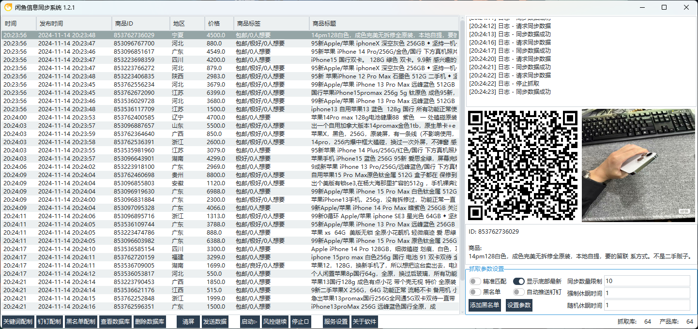

# idle spider
更高效地获取闲鱼数据

原来的软件架构一直是采用hook安卓app的架构，尤其是对于非开发、没有个人维护能力的人员，将hook功能封装成本地软件在使用，是hook的一个可靠的持久化方案。

hook对于app来说，就相当于一个基于代码层，或者Runtime层的一个按键精灵，原理上面并不难懂。但对于运行来说，也就相当于是模拟人工操作运行了。

## 1、框架升级
因为hook架构的局限性，造成了无法稳定快速获取数据。所以一直以来，在学习阿里安全方面技术的同时，也在研究怎么升级和改造自己获取数据的框架——unidbg调用so，甚至直接还原算法。

理论上这样的架构会在获取签名和请求数据的效率上提高不少，尤其是针对风控，针对分部式系统的搭建方面都很容易实现，最终达到提高数据同步的效率。

## 2、抓取延迟

