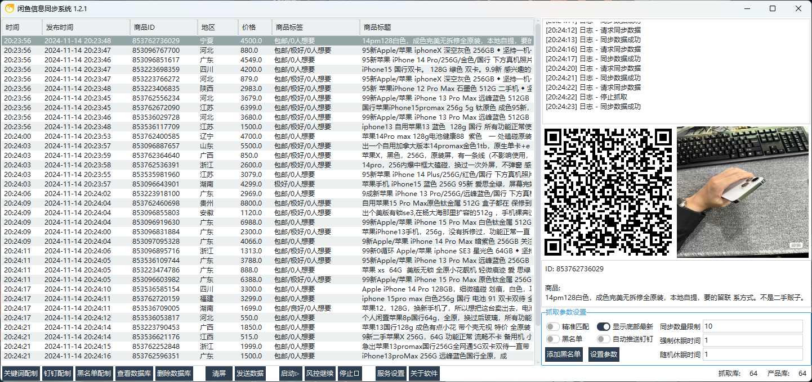

```
个人一直在做闲鱼辅助相关的工具类软件。因为知道阿里系请求和风控的原因，再加个人做软件一直想的是如何让用户稳定运行。

因为阿里系对于请求的风控，所以个人风格导到软件效率一直一般。并不是做不到快速抓取，而是用效率换稳定。

所以，我也一直很好奇那些上来就说要1秒内获取到上新数据，监控最新发布的需求，究竟是怎么想的。而那些号称0.8秒获取到数据的卖家，或者开发者，是否靠谱。
```


原来的软件架构一直是采用hook安卓app的架构，尤其是对于非开发、没有个人维护能力的人员，将hook功能封装成本地软件在使用，是hook的一个可靠的持久化方案。

hook对于app来说，就相当于一个基于代码层，或者Runtime层的一个按键精灵，原理上面并不难懂。但对于运行来说，也就相当于是模拟人工操作运行了。

## 1、测试框架升级
因为hook架构的局限性，造成了无法稳定快速获取数据。所以一直以来，在学习阿里安全方面技术的同时，也在研究怎么升级和改造自己获取数据的框架——unidbg调用so，甚至直接还原算法。

理论上这样的架构会在获取签名和请求数据的效率上提高不少，尤其是针对风控，针对分部式系统的搭建方面都很容易实现，最终达到提高数据同步的效率。



### 2、效率疑云
软件目前已经经过本人自己测试，本人已经在使用了。

但随着使用的进行，我发现大部分所谓采集的最新数据，都要比标准时间延迟2到3秒以上，到6到8秒的数据也有不少。

我目前对自己的架构是十分自信的，那么问题在哪？


闲鱼商品的发布时间，是在闲鱼数据里面自带字段，并不是随意定义的，比如下面这段数据段：


将获取到数据的时间生成一个时间戳，再对比商品的发布时间，即可以获取商品从发布，到被获取到的时间差，这个就可以理解成获取闲鱼商品的延迟。那么，在第二张截图的抓取时间和发布时间对比，发现大部分的睡迟都在4秒和以上，第三张截图（下午测试截图）的延迟也普遍在2秒和2秒以上，可能是因为晚上，发布数据少，而用户请求多，下午时间测试的延迟效果要好于晚上测试。

但这普遍2，3秒的延迟是什么原因造成的，那些号称0.8秒即可以获取闲鱼数据的技术，又到底是什么逆天技术？

## 3、编程语言效率、数据解析延迟？
使用同样的请求后端架构，我分别使用python, Java, Go都写了请求代码，获取到闲鱼数据后，解析获取数据里面延迟最低的那条数据呈现出来，发现...


python测试结果


Java测试结果


Go测试结果

发现不同的编程语言，对于请求数据到本地的延迟其实大差不差。最小延迟基本在2秒，普遍在2-4秒左右。

应该是数据量小，计算压力也不大，所以不同的语言呈现出来的结果大致相同。而且，也说明延迟和语言关系不大。

## 4、一条相同数据，两次获取延迟差为0.387秒！
上面的问题无从着手，但随着继续测试，我发现一个问题。当新数据量不足的时候，两次请求可能获取同一条数据。而同一条数据得到的延迟数据，竟然只有很小的差距。


我们先看一下面的逻辑：

```java
// 假设两次请求获取到了某同一条数据。


int publishTime;  // 同一条数据发布时间
int t1;   // 第1次获取数据时间
int t2;  // 第2次获取数据时间
       
int delay1 = t1 - publishTime;    // 第1获取该数据的延迟
int delay2 = t2 - publishTime;    // 第2获取该数据的延迟
        
int delayDelay = delay2 - delay1;


/*
这时候， delayDelay就等于 t2 - t1
*/
```

如果我们在理论上复现一次这其中的操作：

我们在 t1的时候第1次获取到该数据的同时，马上再次请求，在t1+delayDelay这个时间，再次获取到该数据。

在上图中我们可以看到，这个delayDelay最短为0.387秒。

这说明什么：

```
1. 在这0.387秒内，闲鱼没有新数据发布。

2. 在这0.387秒内，是两次获取到数据的时间差，其前面的最低延迟4秒，这么大的差别不是本地计算差异造成的。

3. 即然两次获取到同一条数据的差距是0.387，那么晚0.387秒，和早0.387秒，是不是也应该能获取到数据。但为什么获取不到
   我们再对比一下获取数据和流程看一下：
```

```

本地组装参数 -> 请求闲鱼 -> 返回数据 -> 本地解析数据 -> 打印结果 

            |            |           |            |
     
        计算延迟        网络延迟      计算延迟    io延迟

```

上面列出了整个过程中的延迟可能出现的地方。但是，对于计算机来说，数据量不大，本地计算的时间，几乎是可以忽略的，这在我前面用不同语言去请求数据，获取到的结果大差不差也能说明。

io延迟的话，这里也可以忽略不计，因为没多少，也不存在竞争打印的情况。

所以，为什么第一次获取到闲鱼数据会有2-4秒的延迟呢？

## 5、网络延迟3秒以上？
我再在在闲鱼请求和获取到数据打上时间节点，获取到这一块的延迟是多少：


可以看到，我的网络情况还是很好的，基本网络延迟在0.6-0.7秒之间。

但这么一对比，闲鱼数据的延迟就更明显了。

## 暂时结论：
到这里，我已经实在想不出其他原因能造成这种延迟情况了。是不是我们可以推测：

1. 闲鱼的数据，在发布后2秒左右，是不对外公开的。系统会对数据做一定的检查、测试，也可以说是评估。毕竟闲鱼发布的内容有时候有审核也是遇到过的。

2. 既然闲鱼在商品发布后2秒内数据是获取不到的，那些号称自己可以在1秒内，甚至是0.8秒获取到数据的人，是套路还是骗局？

以上内容，仅代表个人观点，如有不适，可联系删除。如有帮助，可点赞收藏。

